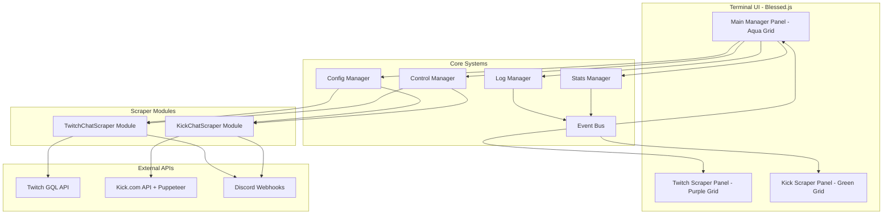
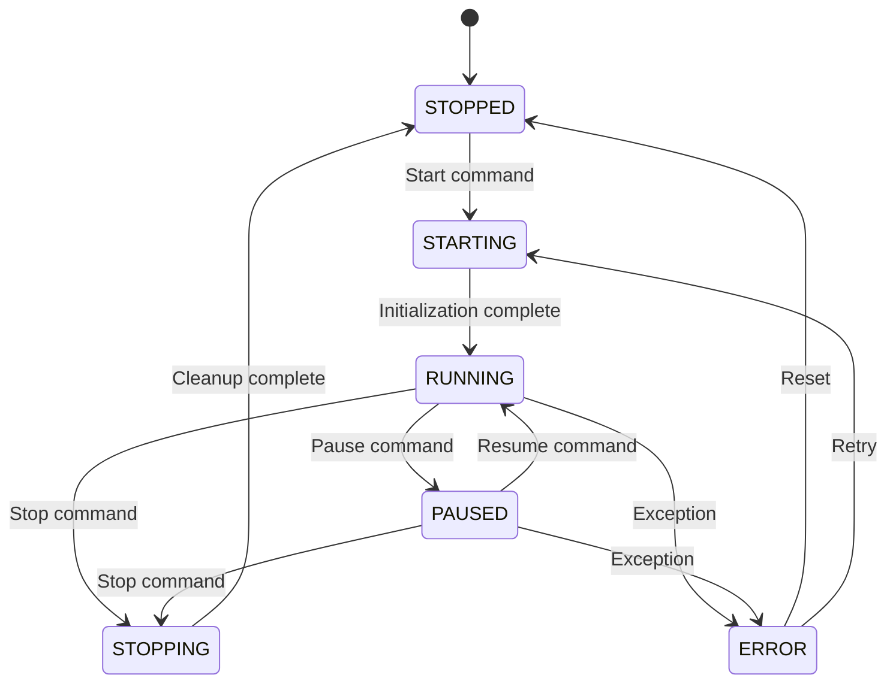

# ChatScraperUltimate - Technical Documentation

## Project Overview

A unified terminal UI application that combines TwitchChatScraper and KickChatScraper into a single TMUX-like interface with a central management system.

## Architecture



## UI Layout Structure

```
┌─────────────────────────────────────────────────────────────────┐
│  MAIN MANAGER (Aqua Grid - #00FFFF)                             │
│  ┌──────────────┐  ┌──────────────┐  ┌──────────────┐           │
│  │ Config       │  │ Logs         │  │ Stats        │           │
│  │ Manager      │  │ Manager      │  │ Manager      │           │
│  └──────────────┘  └──────────────┘  └──────────────┘           │
│  ┌──────────────────────────────────────────────────────────┐   │
│  │ Control Manager: [Start] [Stop] [Pause] [Resume] [Restart]│   │
│  │ Twitch: [● Running]  Kick: [○ Stopped]                   │   │
│  └──────────────────────────────────────────────────────────┘   │
├────────────────────────────┬────────────────────────────────────┤
│  TWITCH SCRAPER            │  KICK SCRAPER                      │
│  (Purple Grid - #9146FF)   │  (Green Grid - #53FC18)            │
│                            │                                    │
│  Status: MONITORING        │  Status: SCANNING                  │
│  VODs: 15                  │  Streams: 127                      │
│  Matches: 3                │  Matches: 8                        │
│  Last Scan: 2m ago         │  Last Scan: 5s ago                 │
│                            │                                    │
│  [Grid Output Area]        │  [Grid Output Area]                │
│  user1: aternos ip found   │  streamer42: exaroton...           │
│  user2: server join        │  streamer89: aternos...            │
└────────────────────────────┴────────────────────────────────────┘
```

## Module Specifications

### 1. Main Manager Panel (Aqua Grid #00FFFF)

**Responsibilities:**
- Central control hub for the entire application
- Configuration management for both scrapers
- Aggregated logging from both scrapers
- Statistics overview
- Process control (start/stop/pause/resume/restart)

**Components:**
- **Config Manager**: Edit .env variables for each scraper
- **Log Manager**: Combined log viewer with filtering
- **Stats Manager**: Real-time statistics dashboard
- **Control Manager**: Process state controls

### 2. TwitchChatScraper Panel (Purple Grid #9146FF)

**Original Features to Port:**
- VOD-based chat scanning
- Keyword filtering (aternos, exaroton)
- Local caching of chat replays
- Discord webhook integration
- Minecraft monitor mode for active streams
- Stream list filtering by viewer count

**New Features:**
- Continuous mode (like KickChatScraper)
- Auto-refresh interval configuration
- Real-time grid output
- State management (running/stopped/paused)

**Technical Details:**
- Uses Twitch GQL API (gql.twitch.tv)
- EventEmitter-based architecture
- Cache folder: `./cache/twitch/`

### 3. KickChatScraper Panel (Green Grid #53FC18)

**Original Features to Port:**
- Live stream scanning via Puppeteer
- Cloudflare bypass using puppeteer-extra-plugin-stealth
- Title, chat history, and pinned message scanning
- Discord webhook integration
- Continuous scanning with wait intervals

**New Features:**
- Integration with unified control system
- Real-time grid output
- State synchronization with main manager

**Technical Details:**
- Uses Puppeteer with Stealth plugin
- API endpoint: web.kick.com/api/v1/
- Category ID 10 = Minecraft

## Event System

```mermaid
flowchart LR
    subgraph Events[Event Types]
        LogEvent[log - {source, level, message, timestamp}]
        StatsEvent[stats - {source, metrics}]
        StateEvent[state - {source, state}]
        MatchEvent[match - {source, data}]
        ConfigEvent[config - {target, key, value}]
    end

    subgraph Producers[Event Producers]
        TS[TwitchScraper]
        KS[KickScraper]
        CM[ConfigManager]
        CTRL[ControlManager]
    end

    subgraph Consumers[Event Consumers]
        UI[UI Manager]
        LM[LogManager]
        SM[StatsManager]
        DB[Dashboard]
    end

    TS --> LogEvent
    TS --> StatsEvent
    TS --> StateEvent
    TS --> MatchEvent
    KS --> LogEvent
    KS --> StatsEvent
    KS --> StateEvent
    KS --> MatchEvent
    CM --> ConfigEvent
    CTRL --> StateEvent

    LogEvent --> LM
    StatsEvent --> SM
    StateEvent --> UI
    MatchEvent --> DB
    ConfigEvent --> UI
```

## Configuration Schema

### Twitch Configuration
```javascript
{
  clientId: String,           // Twitch API Client ID
  clientSecret: String,       // Twitch API Secret
  discordWebhook: String,     // Discord webhook URL
  keywords: String[],         // Default: ["aternos", "exaroton"]
  maxVODs: Number,            // Default: 1
  maxViewers: Number,         // For monitor mode filtering
  streamerCount: Number,      // Max streamers to scan
  cacheEnabled: Boolean,      // Default: true
  cachePath: String,          // Default: "./cache/twitch"
  scanInterval: Number,       // Minutes between scans (continuous mode)
  autoStart: Boolean          // Start on app launch
}
```

### Kick Configuration
```javascript
{
  discordWebhook: String,     // Discord webhook URL
  keywords: String[],         // Default: ["aternos", "exaroton"]
  targetDomains: String[],    // Default: ["aternos.me", "exaroton.me"]
  waitTime: Number,           // Minutes between scans
  categoryId: Number,         // Default: 10 (Minecraft)
  headless: Boolean,          // Puppeteer headless mode
  scanInterval: Number,       // Minutes between scans
  autoStart: Boolean          // Start on app launch
}
```

## State Management

### Process States


### State Definitions
- **STOPPED**: Process not running, no resources allocated
- **STARTING**: Initializing resources, connecting to APIs
- **RUNNING**: Active scanning/processing
- **PAUSED**: Resources held, scanning suspended
- **STOPPING**: Cleaning up resources
- **ERROR**: Exception occurred, waiting for user action

## File Structure

```
ChatScraperUltimate/
├── src/
│   ├── core/
│   │   ├── App.js                 # Main application entry
│   │   ├── EventBus.js            # Central event system
│   │   ├── ConfigManager.js       # Configuration management
│   │   ├── LogManager.js          # Log aggregation
│   │   ├── StatsManager.js        # Statistics tracking
│   │   └── ControlManager.js      # Process control
│   ├── ui/
│   │   ├── TerminalUI.js          # Blessed.js interface
│   │   ├── MainPanel.js           # Main manager panel
│   │   ├── TwitchPanel.js         # Twitch scraper panel
│   │   ├── KickPanel.js           # Kick scraper panel
│   │   └── components/
│   │       ├── GridBox.js         # Colored grid container
│   │       ├── LogBox.js          # Scrollable log display
│   │       ├── StatsBox.js        # Statistics display
│   │       └── ControlBar.js      # Button controls
│   ├── scrapers/
│   │   ├── BaseScraper.js         # Abstract base class
│   │   ├── TwitchScraper.js       # Twitch implementation
│   │   └── KickScraper.js         # Kick implementation
│   └── utils/
│       ├── Logger.js              # Logging utility
│       ├── Config.js              # Config file operations
│       └── StringHighlighter.js   # Terminal colors
├── config/
│   ├── twitch.env                 # Twitch environment config
│   ├── kick.env                   # Kick environment config
│   └── app.json                   # App-wide settings
├── cache/
│   ├── twitch/                    # Twitch chat cache
│   └── kick/                      # Kick data cache
├── logs/
│   ├── twitch.log
│   ├── kick.log
│   └── app.log
├── package.json
└── documentation.md               # This file
```

## Dependencies

### Core Dependencies
```json
{
  "blessed": "^0.1.81",           // Terminal UI framework
  "blessed-contrib": "^4.11.0",   // UI widgets
  "dotenv": "^16.4.5",            // Environment variables
  "eventemitter3": "^5.0.1",      // Event system
  "puppeteer": "^22.0.0",         // Kick browser automation
  "puppeteer-extra": "^3.3.6",    // Puppeteer extensions
  "puppeteer-extra-plugin-stealth": "^2.11.2"
}
```

### Development Dependencies
```json
{
  "nodemon": "^3.0.3"             // Development auto-reload
}
```

## Color Scheme

| Component | Color | Hex Code | Usage |
|-----------|-------|----------|-------|
| Main Manager | Aqua | #00FFFF | Headers, borders, titles |
| Twitch Panel | Purple | #9146FF | Twitch brand color |
| Kick Panel | Green | #53FC18 | Kick brand color |
| Success | Bright Green | #00FF00 | Success messages |
| Warning | Orange | #FFA500 | Warnings |
| Error | Red | #FF0000 | Errors |
| Info | White | #FFFFFF | General info |

## Implementation Phases

### Phase 1: Core Infrastructure
1. EventBus implementation
2. BaseScraper abstract class
3. Configuration management
4. Basic blessed.js layout

### Phase 2: Scraper Modules
1. Refactor TwitchChatScraper to extend BaseScraper
2. Add continuous mode to TwitchChatScraper
3. Refactor KickChatScraper to extend BaseScraper
4. Implement state management

### Phase 3: UI Implementation
1. Main Manager panel with all functions
2. Twitch panel with purple grid
3. Kick panel with green grid
4. Control buttons and status displays

### Phase 4: Integration
1. Event wiring between scrapers and UI
2. Log aggregation
3. Statistics collection
4. Configuration persistence

### Phase 5: Polish
1. Error handling
2. Graceful shutdown
3. Keyboard shortcuts
4. Documentation

## Keyboard Shortcuts

| Key | Action |
|-----|--------|
| `Tab` | Cycle between panels |
| `1` | Focus Main Manager |
| `2` | Focus Twitch Panel |
| `3` | Focus Kick Panel |
| `S` | Start selected scraper |
| `X` | Stop selected scraper |
| `P` | Pause selected scraper |
| `R` | Resume selected scraper |
| `Ctrl+R` | Restart selected scraper |
| `C` | Open config editor |
| `L` | Toggle log view |
| `Q` / `Ctrl+C` | Quit application |
| `↑/↓` | Scroll in panels |
| `F1` | Help |

## API Reference

### BaseScraper Methods
```javascript
abstract class BaseScraper {
  constructor(name, config)
  async initialize()
  async start()
  async stop()
  async pause()
  async resume()
  getStats()
  getState()
  on(event, callback)
  emit(event, data)
}
```

### EventBus Methods
```javascript
class EventBus {
  subscribe(event, callback, source)
  unsubscribe(event, callback)
  publish(event, data, source)
  clear()
}
```

### TerminalUI Methods
```javascript
class TerminalUI {
  constructor()
  initialize()
  setPanelContent(panel, content)
  setPanelStatus(panel, status)
  showNotification(message, type)
  focusPanel(panel)
  render()
  destroy()
}
```

## Notes

1. **TwitchChatScraper** currently runs once and exits. Adding continuous mode requires implementing a polling loop similar to KickChatScraper.

2. **KickChatScraper** uses Puppeteer which is resource-intensive. Consider implementing a check to ensure only one browser instance runs at a time.

3. **Discord Webhooks** should be rate-limited to avoid hitting Discord's rate limits.

4. **Caching** strategy should be unified between both scrapers with configurable cache expiration.

5. **Error Recovery** should include automatic retry logic with exponential backoff.
